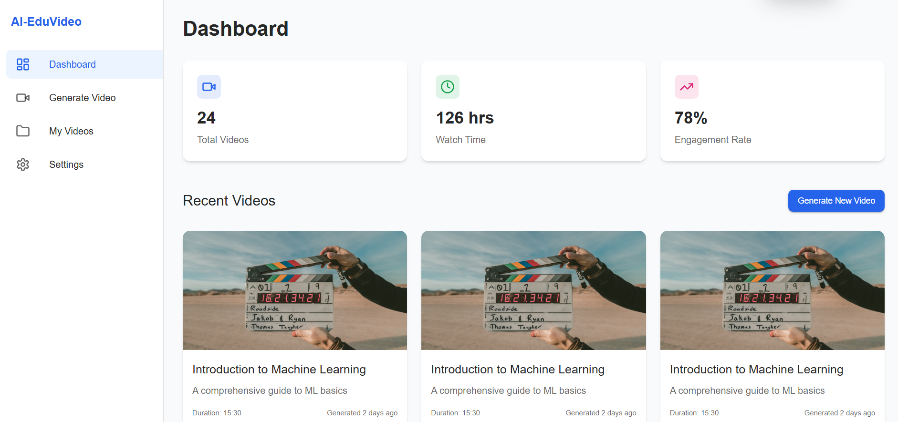

# Ai-Revolutionizing-Student-Education-with-AI-Generated-Video-Content




## 🌍 Overview
**Revolutionizing Student Education with AI-Generated Video Content** is an AI-powered adaptive learning platform that dynamically personalizes video tutorials based on real-time student responses. Unlike traditional static videos, our solution ensures an interactive and engaging experience, helping students grasp concepts more effectively.

🔗 **Website**: [https://mellifluous-kataifi-a8c5b5.netlify.app/
]

## 🚀 Features
- **Adaptive Learning**: Real-time content adjustments based on student responses.
- **AI Tutor Avatar**: Provides hints, clarifications, and real-time assistance.
- **Interactive Checkpoints**: Assess understanding and modify the learning path dynamically.
- **Pre-Assessment Quiz**: Creates a personalized learning model before the lesson starts.
- **Real-Time Feedback Loop**: Continuously refines the learning experience.
- **Automated Content Creation**: Scalable and efficient video generation.
- **Engagement Boosters**: Quizzes, gamification elements, and leaderboards.

## 🛠 Technology Stack
### Frontend:
- React.js
- Tailwind CSS

### Backend:
- Node.js
- Firebase

### Database:
- Firestore

### Google Technologies:
- Google Gemini API
- Vertex AI
- Google Cloud NLP
- Dialogflow (for chatbot interactions)
- Google Cloud Video AI (for automated video generation)

## 📥 Installation
1. Clone the repository:
   ```sh
   git clone https://github.com/your-repo/project-name.git
   ```
2. Navigate to the project folder:
   ```sh
   cd project-name
   ```
3. Install dependencies:
   ```sh
   npm install
   ```
4. Run the development server:
   ```sh
   npm start
   ```

## 📌 Future Enhancements
- Advanced AI personalization using reinforcement learning.
- Enhanced 3D AI tutor avatars for immersive learning.
- Augmented Reality (AR) integration for interactive lessons.
- Multilingual support for regional languages.
- Mobile app version for iOS & Android.

## 🤝 Contributing
We welcome contributions! Feel free to fork the repository, raise issues, or submit pull requests.

## 📜 License
This project is licensed under the **MIT License**.

---

🚀 **Join us in transforming education with AI!** If you like this project, give it a ⭐ on GitHub and stay tuned for updates!
